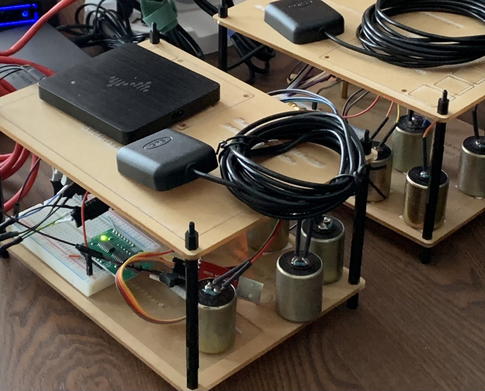

# Geophone.Dev

An open-source platform for seismic data acquisition and analysis, built on Linux and running on low-cost single-board computers.

## Repositories

### 🖥️ OS & Build System

| Repository | Description |
|---|---|
| [geophone-manifests](https://github.com/geophone-dev/geophone-manifests) | Yocto manifest file — use this to fetch and build the full OS image |
| [meta-geophone](https://github.com/geophone-dev/meta-geophone) | Yocto layer with geophysical tools and recipes |

### ⚙️ Daemons & Services

| Repository | Description |
|---|---|
| [geod](https://github.com/geophone-dev/geod) | Geophysics daemon — core service for data acquisition |

### 🔌 Hardware Drivers & Low-Level Tools

| Repository | Description |
|---|---|
| [kernel-module-ads1256](https://github.com/geophone-dev/kernel-module-ads1256) | Linux kernel driver for the TI ADS1256 ADC via SPI |
| [adc-reader](https://github.com/geophone-dev/adc-reader) | Simple tooling to read data from ADC chips |
| [adc-fast-reader](https://github.com/geophone-dev/adc-fast-reader) | High-speed ADC data reader using DMA on Raspberry Pi |
| [arbitrary-waveform-generator](https://github.com/geophone-dev/arbitrary-waveform-generator) | DAC-based waveform generator using Raspberry Pi Pico |

### 📊 Data Analysis

| Repository | Description |
|---|---|
| [geophone-notebooks](https://github.com/geophone-dev/geophone-notebooks) | Jupyter Notebooks for seismic signal processing and data analysis |

## Supported Hardware

* Raspberry Pi 3B
* Raspberry Pi Zero

## Getting Started

To build the OS images, follow the instructions in [geophone-manifests](https://github.com/geophone-dev/geophone-manifests).
